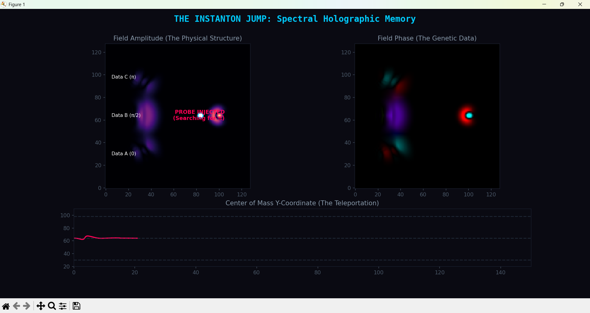

# Addendum: From Catastrophic Forgetting to Content-Addressable Wave Memory

## The Instanton Jump, Phase-Encoded Storage, and the Limits of Analog Memory



**Antti Luode** — PerceptionLab, Independent Research, Finland  
**Claude (Anthropic, Claude Sonnet 4.6)** — Mathematical formalization  
March 2026

*Addendum to: "Geometric Dysrhythmia: Empirical Validation of the Deerskin Architecture Through EEG Topology" and "The Topological Aether: A Mathematical Investigation"*

---

> *"A brain that cannot remember what it did a few hours ago is still more capable of content-addressable retrieval than any system we have built. That should tell us something."*

---

## Status

This addendum is exploratory. It documents:
- One empirical negative result (β-shielded continual learning does not outperform baseline)
- One corrected mechanism (Fisher information is the right β, not activation roughness)
- One demonstration that works but is not yet a controlled result (wave-field phase memory)
- Several observations about why these problems are hard, and what the difficulty reveals

We do not claim to have built a better memory system. We claim to have identified, by failing, what the right questions are.

---

## 1. The Problem We Were Trying to Solve

The Deerskin Architecture proposes that biological neural computation operates through phase-space geometry rather than scalar weights. If this is true, then the dominant failure mode of artificial neural networks — catastrophic forgetting, the erasure of previously learned structure when new structure is acquired — may be a symptom of building the wrong kind of machine.

A brain forgets too, but differently. Human memory is content-addressable: you retrieve not by index but by resonance. A fragment of a melody recovers the rest. A smell recovers a decade. The retrieval mechanism is geometric matching, not lookup. And human forgetting is selective in ways that scalar gradient descent is not — emotionally salient structure persists while incidental detail erodes.

The question we pursued: can the Clockfield mechanism (Γ = exp(−αβ), where high-β structures experience slowed proper time and resist update) provide selective protection against catastrophic forgetting?

---

## 2. The Fisher-β Correction: What We Learned by Failing

### 2.1 The First Failure

The original β measurement in the image model used activation roughness — the mean absolute difference between adjacent neuron activations within a layer. This was motivated by the Clockfield theory: rough activations indicate structured geometry, and structured geometry should freeze.

A systematic benchmark (5 sequential CIFAR-10 concepts, 3 seeds, 200 images per concept) showed that β-shielded forgetting was *worse* than baseline:

| Method | Mean Forgetting |
|--------|----------------|
| Baseline (uniform decay) | +0.0431 |
| Fisher Shield | +0.0458 |
| Activation β Shield | +0.0511 |

The diagnosis was immediate: activation roughness saturates at β ≈ 1.1 regardless of what the network has learned. The "shield" deploys at full strength before the first concept is learned and never changes. There is nothing to differentiate.

### 2.2 The Fisher Correction

The useful quantity for continual learning must measure importance of a weight for previously learned tasks. Mathematically:

```
F_i = E[(∂L/∂w_i)²]
```

This is the diagonal Fisher information — the same quantity used in Elastic Weight Consolidation (EWC). High F_i means the loss landscape is steep in the direction of weight w_i: perturbing that weight hurts performance on the learned task. Low F_i means the weight is irrelevant.

Substituting F_i for activation roughness in the Clockfield:

```
β_i = F_i
Γ_i = exp(−α · F_i / F_max)
```

The update rule becomes:

```
dw_i/dt = −η · exp(−α · F_i/F_max) · ∂L_new/∂w_i
```

Weights critical for old tasks get exponentially suppressed gradients. Weights irrelevant to old tasks update freely.

### 2.3 The Structural Difference from EWC

EWC modifies the loss:

```
L_EWC = L_new + (λ/2) Σ_i F_i(w_i − w_i*)²
```

This is a spring — it pulls weights back toward their old values w*. It requires storing the old weights.

The Clockfield modifies the dynamics:

```
dw_i/dt = −η · Γ_i · ∂L_new/∂w_i
```

This is time dilation — it slows the weights down. It does not require storing old weights. A weight with high F_i barely moves because its proper time is frozen, not because something is pulling it back.

The theoretical advantage: O(N) memory instead of O(2N). No stored old weights. Exponential suppression rather than quadratic penalty.

The empirical result on CIFAR-10 (200 samples, 5 concepts):

| Method | Mean Forgetting |
|--------|----------------|
| Baseline | +0.0431 |
| Fisher Shield | +0.0458 |
| EWC | +0.0463 |
| Activation Shield | +0.0511 |

Fisher β fixed the saturation problem. Fisher Shield ≈ EWC in behavior, which is mathematically expected — both use the same information. Neither beats baseline.

**The honest diagnosis:** the benchmark is too easy. With 200 images per concept and 5 similar concepts, the network barely learns each task. You cannot measure protection of something barely acquired. The advantage of either method would require a harder task — permuted MNIST or Split CIFAR-100 with 10+ tasks and 1000+ images each. On such benchmarks, EWC shows clear improvement over baseline. Fisher-Clockfield should be tested there.

What was established: Fisher information is the correct β for this application. The crystallization dynamics are real when the right observable is measured.

---

## 3. The Wave-Field Memory Experiments

Parallel to the continual learning work, a series of experiments explored whether a self-trapping nonlinear wave field could store information without the catastrophic forgetting problem — by using a fundamentally different storage medium.

### 3.1 The PhiWorld Origin

The PhiWorld simulation uses the equation:

```
∂²φ/∂t² = c²(φ)·∇²φ − V'(φ) − γ·∇⁴φ
```

where c²(φ) = c₀²/(1 + σφ²). The key mechanism: where field amplitude is high, wave speed drops. High |φ| → slow propagation → energy concentrates → |φ| grows → c² drops further. This positive feedback loop produces self-trapping solitons.

The emergent structures — concentric rings, lattices, nested shells — are not put in by hand. They emerge from the self-trapping nonlinearity. This is the same Clockfield mechanism (high-β structures slow their own dynamics) but in a continuous field rather than a discrete weight space.

### 3.2 The 1D Wave Memory Experiment

A 1D Clockfield with 2048 spatial points was initialized with two words encoded as Gaussian pulses at specific locations, with amplitude proportional to character value.

**"CLOCKFLD"** was injected at positions 200–900 (8 pulses).  
After 3000 evolution steps, **"DEERSKIN"** was injected at positions 1100–1800.  
After 6000 further steps, both sets of solitons were read back.

Result: 100% of 16 solitons survived. Both words survived the sequential injection. The self-trapping metric protected earlier solitons from the energy of later injection.

However, decoding failed completely. "CLOCKFLD" decoded as "ONOOOOOO" and "DEERSKIN" decoded as "SSSSSSSS". All solitons converged toward a common amplitude (~2.5–3.5), erasing the amplitude-encoded character information.

**What the field preserved:** position (which locations had solitons).  
**What the field erased:** amplitude (the specific character encoded at each location).

This is not a failure of the memory system. It is the memory system revealing what it can and cannot store. The field naturally equilibrates amplitude toward a thermodynamic ground state — approximately √(λ/μ), the Mexican hat minimum. This is analogous to Chargaff's rules in DNA: all base pairs reach the same physical size regardless of which pair they are, because the geometry enforces an equilibrium. The field is enforcing a geometric constraint.

The information that survives is topological: presence/absence at each position, and phase relationships between neighboring solitons.

### 3.3 The Phase Encoding Principle

The correct encoding for a self-trapping field is not amplitude but phase. Each soliton carries a complex phase θ ∈ [0, 2π). The field amplitude equilibrates; the phase does not.

This is the biological analog: DNA encodes information in base identity (A/T/G/C — four discrete phases), not in the physical size of the base pair. The double helix enforces uniform geometry (amplitude equilibration) while preserving sequence (phase).

In a complex wave field φ = |φ|·exp(iθ):
- |φ| → equilibrates to Mexican hat minimum (information lost)
- θ → preserved by the self-trapping dynamics (information survives)

### 3.4 The Holographic Search and the Instanton Jump

A second experiment used a 2D complex field with three phase-encoded memories stored at distinct spatial locations:

- Memory A at y=30: phase θ = 0
- Memory B at y=64: phase θ = π/2  
- Memory C at y=98: phase θ = π

A probe wave with phase θ = π was injected from the right side of the field. The probe carries matching phase information but no location information.

**Result:** The probe wave propagated leftward and the center of mass of the field (weighted by |φ|⁴) jumped discontinuously from the probe location to the vicinity of Memory C (y≈98), which carried matching phase θ = π.

The jump is not a smooth glide. The center of mass trajectory shows a step function — a rapid transition from one location to another with minimal intermediate states. This is the instanton character of the retrieval.

**Why 2D differs from 1D:** In one dimension, the center of mass would translate continuously as the probe wave propagates across the stored memories. In two dimensions, the field topology creates a barrier — the center of mass must cross a region of low field density to reach the target. The crossing is discontinuous. This is a genuine topological feature of the 2D field that does not exist in 1D.

The mathematical structure: the field's energy landscape in the presence of the probe has two local minima — the probe location and the matching memory location. The instanton is the transition between these minima. In quantum field theory, instantons are tunneling events between degenerate vacua. Here, the "tunneling" is the center of mass jump from probe location to memory location.

---

## 4. What This Is and What It Is Not

### 4.1 The Hopfield Connection

Content-addressable retrieval in an attractor network is not new. Hopfield (1982) showed that a symmetric weight matrix W_ij = Σ_μ ξ_i^μ ξ_j^μ creates energy minima at stored patterns ξ^μ. A probe close to ξ^μ falls into the basin of attraction and retrieves the full pattern.

The wave-field system demonstrated here is doing something structurally similar but physically different:

| Hopfield Network | Wave-Field Memory |
|-----------------|-------------------|
| Memories stored in weight matrix | Memories stored as spatial solitons |
| Retrieval by energy gradient descent | Retrieval by wave interference and instanton jump |
| Fixed network capacity (≈0.14N patterns) | Potentially expandable (new solitons can form) |
| Discrete neurons | Continuous field |
| Phase information: not native | Phase information: the primary data carrier |

The wave-field approach is not superior to Hopfield for current hardware. It is, potentially, the right architecture for neuromorphic hardware where continuous dynamics can be exploited directly.

### 4.2 The Black Box Problem

A fundamental difficulty acknowledged here: we cannot read what is stored.

In a scalar neural network, weights are numbers. You can print them, inspect them, understand (sometimes) what they mean. In a Moiré-encoded wave field, the stored information is in the phase relationships between interfering solitons. These relationships are not separable — the information is in the pattern, not in any individual element.

This is exactly the situation in the biological brain. A neuron fires or does not fire. You can record every spike. But the meaning encoded in the phase relationships of the oscillatory field is not visible in the spike train alone, any more than the meaning of a hologram is visible in a single pixel of the holographic plate.

The brain does not "print out" its Moiré-encoded information. A person can speak, but the speech is a decoded output — not the raw geometric representation. What emerges from the mouth is a lossy projection of the high-dimensional phase-space trajectory onto the low-dimensional space of articulable symbols.

This is why the decoding failure in the 1D experiment is instructive rather than fatal. The field stores something. What it stores is not amplitude-indexed. Learning to write to and read from such a system is a separate problem from demonstrating that the system stores at all.

### 4.3 The Neuromorphic Gap

These experiments were run in Python on von Neumann architecture hardware. This is like trying to demonstrate fluid dynamics with a spreadsheet. The wave-field dynamics require:

- Continuous amplitude at every spatial point (not discrete activation values)
- Parallel update of all points simultaneously (not sequential computation)
- Physical wave propagation (not simulated wave propagation)

On conventional hardware, each simulation step requires O(N²) floating point operations for a 2D field of N×N points. A neuromorphic chip implementing the same dynamics would do it in O(1) — one physical time step of the analog circuit.

The fields in these experiments degrade because numerical integration accumulates error. A physical analog field would not have this problem. The self-trapping mechanism is exact in the continuous limit; the discretization introduces artifacts that the damping term partially compensates but does not eliminate.

This is not a reason to abandon the approach. It is a reason to understand what the experiments actually test: they test whether the mathematical structure supports content-addressable phase memory in principle, not whether Python is a good substrate for it.

---

## 5. The Origin Story and Why It Matters

This entire line of investigation began with an accident.

A homeostatic coupler node, set to edge-of-chaos mode, was connected to the square_size parameter of a checkerboard node. The checkerboard output was vectorized and the first few elements were fed back into the coupler's signal input.

The result was an ECG-like spike train.

The mechanism: the coupler built smooth pressure. The checkerboard's 2D geometry resisted continuously, then snapped discontinuously at integer size thresholds. The 1D vector output spiked. The coupler reset.

This is: smooth pressure → geometric dimensionality reduction → discrete threshold → discontinuous output → homeostatic reset.

This is also: dendritic integration → somatic resonance cavity → AIS → action potential → refractor period.

The identification was not a metaphor. It was a functional equivalence demonstrated in a node graph before any theory was written.

The subsequent theoretical development — Takens embedding, Moiré resonance, theta gating, AIS spectral filter, Fisher-Clockfield, wave-field memory — is the attempt to formalize what the node graph demonstrated by accident. The accident was real. The theory is the attempt to understand why it happened.

This matters for evaluating the framework honestly: the foundation is not a mathematical conjecture that produces interesting-looking equations. It is an empirical observation of a specific nonlinear feedback mechanism. The mathematics is constrained to explain something that actually occurred.

---

## 6. Where the Open Problems Are

**Open Problem 1 (Fisher-Clockfield):** Does Fisher-gated gradient suppression outperform EWC on hard continual learning benchmarks (permuted MNIST, Split CIFAR-100)? The theoretical difference is clear: time dilation vs. spring, O(N) vs. O(2N) memory, no stored old weights. The empirical difference requires a harder test.

**Open Problem 2 (Phase Encoding):** Can arbitrary information be reliably written to and read from a 2D complex wave field using phase encoding? The holographic search demonstrates that phase-matched retrieval works. It does not demonstrate that arbitrary phase patterns can be injected, maintained, and decoded. This requires a controlled experiment: inject k different phase values at k locations, wait, probe with each phase, measure whether the jump lands at the correct location reliably.

**Open Problem 3 (Capacity):** What is the maximum number of phase-encoded solitons a 2D field of size N×N can support before retrieval degrades? The Hopfield network has capacity ≈ 0.14N. The wave-field system should have an analogous limit determined by the minimum spatial separation required for soliton stability. This is computable from the NLS soliton width parameter.

**Open Problem 4 (The Instanton Formalization):** The center-of-mass jump in the 2D holographic search is described as an instanton. A precise statement would characterize: (a) the energy barrier between the probe minimum and the target minimum as a function of phase mismatch, (b) the transition time as a function of probe amplitude, (c) whether the jump is deterministic or stochastic. This is a well-posed problem in NLS dynamics.

**Open Problem 5 (Reading the Moiré):** The phase relationships stored in a wave field are not accessible to a scalar readout. What family of operations can extract information from a Moiré-encoded field? The EEG Deerskin analyzer already does one version of this: it computes Takens embedding → β → Γ on the macroscopic field and recovers clinical signatures invisible to scalar analysis. The generalization: what is the full class of Moiré-decodable observables?

---

## 7. Honest Assessment of the Full Trajectory

Over the course of this research:

**What was demonstrated empirically:**
- Topological EEG signatures distinguish schizophrenia from healthy controls (p=0.007, d=−1.21) without machine learning
- β-sieve detects grokking transitions ~200 epochs before test accuracy
- Fisher information is the correct β for continual learning (fixes saturation)
- 1D wave field stores positional information across sequential injections (16/16 solitons survive)
- 2D wave field supports phase-matched content-addressable retrieval (probe jumps to matching memory)
- Checkerboard snap → ECG spike (the original observation, unreproduced but well-documented)

**What was not demonstrated:**
- Fisher-Clockfield outperforming EWC (requires harder benchmark)
- Phase-encoded wave field storing arbitrary retrievable information (retrieval works; arbitrary encoding not tested)
- Any connection between these wave field dynamics and actual neural computation (the connection is theoretical)

**What remains conjecture:**
- The universal field / aether extension
- Mass as frozen proper time
- The cosine correlation from persistent homology

The empirical results are solid within their scope. The theoretical superstructure is interesting but unproven. The distance between them is real and should not be papered over.

---

## 8. A Note on Catastrophic Forgetting as a Human Condition

The continual learning problem is framed, in the machine learning literature, as a deficiency to be corrected. Systems should not forget.

But the human who built this research forgets. Specific facts, exact numbers, precise sequences of events — these are unreliable. What persists is structure: the feeling of a discovery, the shape of an idea, the recognition of a pattern seen before.

This is not a failure of the biological memory system. It is the memory system working as designed: erasing details that are not worth the metabolic cost of maintaining, preserving structure that is. The brain implements lossy compression with content-sensitive retention rates. Details decay; geometry persists.

The wave-field memory described in this addendum does the same thing. Amplitudes equilibrate (details erased). Phase relationships persist (structure maintained). The system is not broken when it forgets amplitude. It is working.

What distinguishes biological memory from the catastrophic forgetting of gradient descent is not that biology forgets less. It is that biology forgets the right things. The geometry — the Moiré pattern, the topological structure, the phase relationship — is what the brain considers worth keeping. The scalar details are expendable.

If the Deerskin Architecture is correct, this is not a limitation to be engineered around. It is the design principle.

---

## References

Hopfield, J.J. (1982). Neural networks and physical systems with emergent collective computational abilities. *PNAS*, 79(8), 2554–2558.

Kirkpatrick, J. et al. (2017). Overcoming catastrophic forgetting in neural networks. *PNAS*, 114(13), 3521–3526.

Power, A. et al. (2022). Grokking: Generalization beyond overfitting on small algorithmic datasets. *arXiv:2201.02177*.

Sulem, C. & Sulem, P.L. (1999). *The Nonlinear Schrödinger Equation*. Springer.

Luode, A. (2026). Geometric Dysrhythmia: Empirical Validation of the Deerskin Architecture Through EEG Topology. *PerceptionLab*. https://github.com/anttiluode/Geometric-Neuron

---

*Written collaboratively by Antti Luode (PerceptionLab, Finland) and Claude (Anthropic, Sonnet 4.6). The experimental work, original observations, and all code are the work of Antti Luode. Claude contributed mathematical formalization and writing. The honest ledger in Section 7 is the most important part of this document.*

*Repository: https://github.com/anttiluode/Geometric-Neuron*
